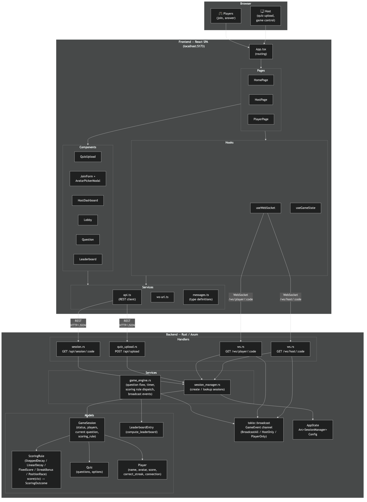

# Application Architecture



## Overview

The application is a real-time multiplayer quiz game with a Rust backend and a React frontend communicating over WebSockets. All game state is held in memory for the duration of a session — there is no database.

```
Browser → React SPA (port 5173) → Rust/Axum server (port 3000)
                                      ├── REST  (quiz upload, session lookup)
                                      └── WebSocket  (all real-time game events)
```

---

## Frontend — React SPA

**Technology**: React 19, TypeScript 5.x, Rspack, Biome

### Pages

| Page | Route | Role |
|------|-------|------|
| `HomePage` | `/` | Landing — links to host and join flows |
| `HostPage` | `/host` | Quiz upload → game control → final leaderboard |
| `PlayerPage` | `/play` | Join form → lobby → questions → final leaderboard |

### Hooks

| Hook | Responsibility |
|------|---------------|
| `useWebSocket` | Opens and manages the WebSocket connection; sends and receives raw messages |
| `useGameState` | Parses incoming WebSocket messages and maintains the full local game state (players, scores, phase) |

### Key Components

| Component | Description |
|-----------|-------------|
| `QuizUpload` | File picker that POSTs the quiz file to `/api/upload` and receives the join code |
| `JoinForm` | Join code + display name form; hosts the avatar preview trigger |
| `AvatarPickerModal` | Blocking modal overlay over the 30-emoji picker; opens on avatar preview click |
| `HostDashboard` | Shows connected players, starts the game, displays per-question results |
| `Lobby` | Waiting room shown to players before the game starts |
| `Question` | Timed question view with answer options and countdown |
| `Leaderboard` | Ranked standings shown after each question and at game end |

### Services

| Module | Responsibility |
|--------|---------------|
| `api.ts` | REST calls — quiz upload (`POST /api/upload`) and session lookup (`GET /api/session/:code`) |
| `messages.ts` | TypeScript type definitions for all WebSocket message payloads |
| `ws-url.ts` | Constructs the WebSocket URL with name + avatar query parameters |

---

## Backend — Rust / Axum

**Technology**: Rust (stable, edition 2024), Axum, Tokio, tokio::sync::broadcast

### HTTP / WebSocket Routes

| Route | Handler | Description |
|-------|---------|-------------|
| `POST /api/upload` | `quiz_upload.rs` | Parses quiz file, creates a `GameSession`, returns join code |
| `GET /api/session/:code` | `session.rs` | Validates a join code; returns session status for the join form |
| `GET /ws/host/:code` | `ws.rs → ws_host` | Upgrades to WebSocket for the host; drives game flow |
| `GET /ws/player/:code?name=&avatar=` | `ws.rs → ws_player` | Upgrades to WebSocket for a player; relays game events |

### Services

| Service | Responsibility |
|---------|---------------|
| `session_manager.rs` | Creates, stores, and retrieves `GameSession` instances keyed by join code |
| `game_engine.rs` | Orchestrates the question loop: sends questions, runs the countdown timer, collects answers, computes and broadcasts results, triggers the final leaderboard |
| `scoring.rs` | Calculates points for a correct answer based on answer speed within the time window |

### Models

| Model | Fields |
|-------|--------|
| `GameSession` | `join_code`, `quiz`, `players`, `host_id`, `current_question`, `status`, `question_started` |
| `Quiz` | Title, list of `Question` (text + options, one marked correct) |
| `Player` | `display_name`, `avatar`, `score`, `correct_count`, `connection_status` |
| `LeaderboardEntry` | Computed from `Player` slice — ranked by score, then name |

### Real-time Broadcast

All game events flow through a **per-session `tokio::broadcast` channel**. The `game_engine` sends `GameEvent` variants:

| Variant | Receivers |
|---------|-----------|
| `BroadcastAll(msg)` | Host + all players |
| `HostOnly(msg)` | Host WebSocket only |
| `PlayerOnly { player_id, msg }` | Single player WebSocket |

Each connected WebSocket task subscribes to this channel and forwards matching messages to its client.

---

## Data Flow: Joining a Game

```
Player browser                Frontend                    Backend
     │                            │                           │
     │── fills join form ─────────▶                           │
     │                            │── GET /api/session/:code ▶│
     │                            │◀─ { join_code, ws_url } ──│
     │                            │                           │
     │                            │── WS /ws/player/:code ────▶
     │                            │     ?name=Alice            │
     │                            │     &avatar=🦁             │
     │                            │                           │── PlayerJoined → broadcast
     │◀─ Lobby (waiting room) ────│◀── player_joined msg ─────│
```

## Data Flow: Running a Question

```
Host                        game_engine                  Players
 │── "start" msg ──────────▶ │                               │
 │                           │── question msg (BroadcastAll)▶│
 │◀── question msg ──────────│                               │
 │                           │   [countdown timer]           │
 │                           │◀──── answer msg ──────────────│
 │                           │   calculate_points()          │
 │                           │── feedback (PlayerOnly) ─────▶│
 │◀── question_result ───────│── question_result (HostOnly)  │
 │                           │── leaderboard (BroadcastAll) ▶│
 │◀── leaderboard ───────────│                               │
```

---

## Session Lifecycle

```
Created (Lobby) ──▶ Active ──▶ Finished
                      │
                   Paused  (host disconnected)
                      │
                   Active  (host reconnected)
```

Players and hosts can reconnect within a 120-second window after disconnecting. On reconnect, they receive the current game state and resume participation.
