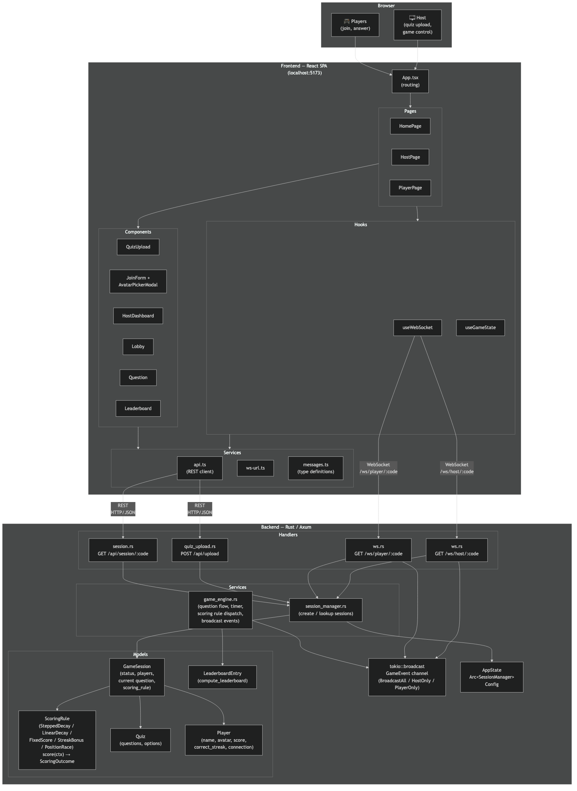
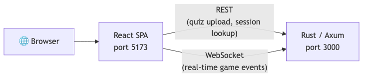
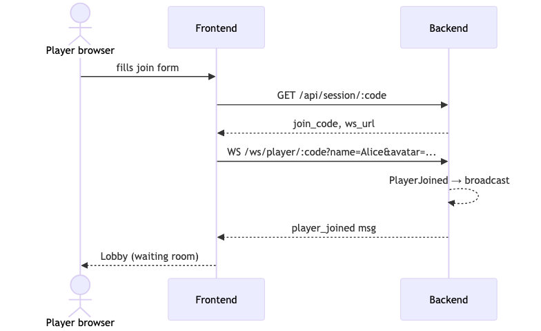
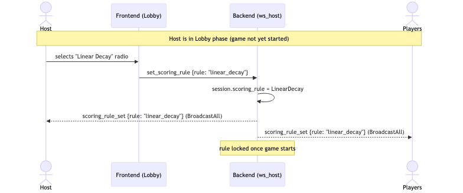
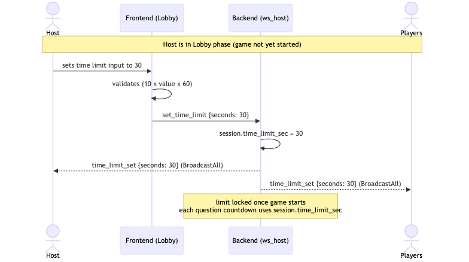
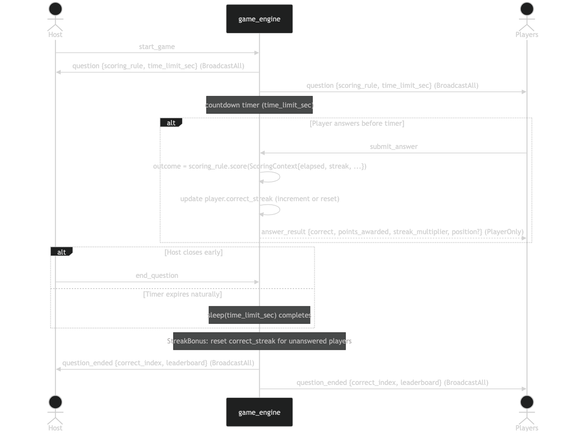
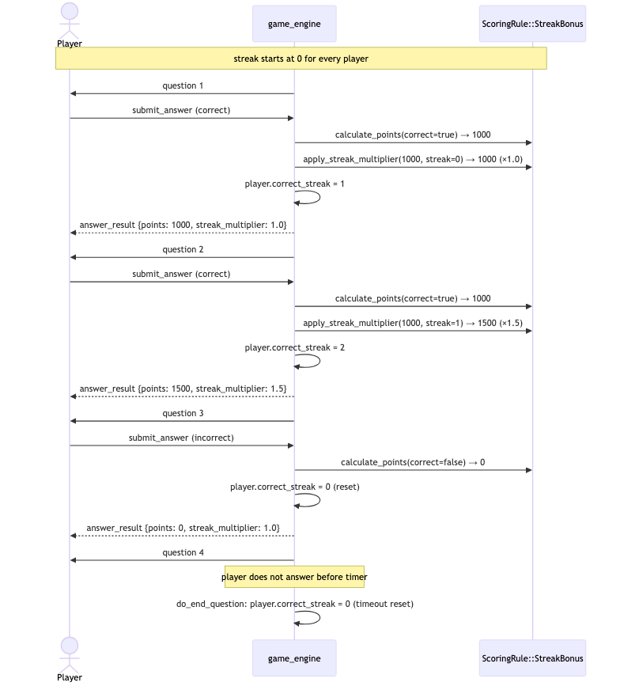
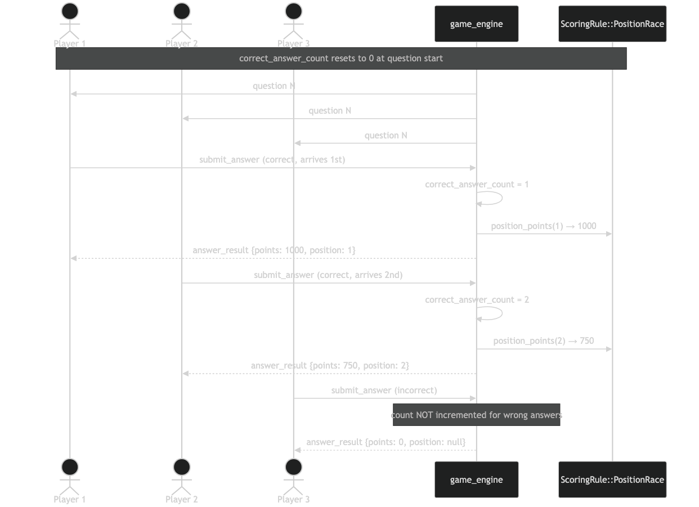
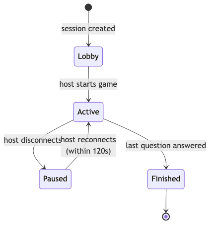

# Application Architecture

## Overview

The application is a real-time multiplayer quiz game with a Rust backend and a React frontend communicating over WebSockets. All game state is held in memory for the duration of a session — there is no database.

---

## Frontend — React SPA

**Technology**: React 19, TypeScript 5.x, Rspack, Biome

### Pages

| Page | Route | Role |
|------|-------|------|
| `HomePage` | `/` | Landing — links to host and join flows |
| `HostPage` | `/host` | Quiz upload → game control → final leaderboard |
| `PlayerPage` | `/play` | Join form → lobby → questions → final leaderboard |

### Hooks

| Hook | Responsibility |
|------|---------------|
| `useWebSocket` | Opens and manages the WebSocket connection; sends and receives raw messages |
| `useGameState` | Parses incoming WebSocket messages and maintains the full local game state (players, scores, phase) |

### Key Components

| Component | Description |
|-----------|-------------|
| `QuizUpload` | File picker that POSTs the quiz file to `/api/upload` and receives the join code |
| `JoinForm` | Join code + display name form; hosts the avatar preview trigger |
| `AvatarPickerModal` | Blocking modal overlay over the 30-emoji picker; opens on avatar preview click |
| `HostDashboard` | Shows per-question progress, answer count, standings, and an "End Question" button to close the current question early |
| `Lobby` | Waiting room; host can select the scoring rule and configure the per-question time limit before starting |
| `Question` | Timed question view with answer options, countdown, and active scoring rule label |
| `Leaderboard` | Ranked standings shown after each question and at game end |

### Services

| Module | Responsibility |
|--------|---------------|
| `api.ts` | REST calls — quiz upload (`POST /api/upload`) and session lookup (`GET /api/session/:code`) |
| `messages.ts` | TypeScript type definitions for all WebSocket message payloads, including `ScoringRuleName` (`stepped_decay` / `linear_decay` / `fixed_score` / `streak_bonus` / `position_race`), `AnswerResultPayload` (with `streak_multiplier` and optional `position`), `SetTimeLimitPayload`, and `TimeLimitSetPayload` |
| `ws-url.ts` | Constructs the WebSocket URL with name + avatar query parameters |

---

## Backend — Rust / Axum

**Technology**: Rust (stable, edition 2024), Axum, Tokio, tokio::sync::broadcast

### HTTP / WebSocket Routes

| Route | Handler | Description |
|-------|---------|-------------|
| `POST /api/upload` | `quiz_upload.rs` | Parses quiz file, creates a `GameSession`, returns join code |
| `GET /api/session/:code` | `session.rs` | Validates a join code; returns session status for the join form |
| `GET /ws/host/:code` | `ws.rs → ws_host` | Upgrades to WebSocket for the host; drives game flow |
| `GET /ws/player/:code?name=&avatar=` | `ws.rs → ws_player` | Upgrades to WebSocket for a player; relays game events |

### Services

| Service | Responsibility |
|---------|---------------|
| `session_manager.rs` | Creates, stores, retrieves, and removes `GameSession` instances keyed by join code; sessions are removed on game termination to reclaim memory |
| `game_engine.rs` | Orchestrates the question loop: sends questions, runs the countdown timer, collects answers, delegates point calculation to the session's `ScoringRule`, broadcasts results, triggers the final leaderboard, removes the session from `SessionManager` on game end |

### Models

| Model | Fields |
|-------|--------|
| `GameSession` | `join_code`, `quiz`, `players`, `host_id`, `current_question`, `correct_answer_count`, `status`, `question_started`, `scoring_rule`, `time_limit_sec` |
| `ScoringRule` | Enum: `SteppedDecay` (−250 pts every 5 s), `LinearDecay` (−50 pts/s), `FixedScore` (always max), `StreakBonus` (always 1000 pts base, multiplied by ×(1 + streak × 0.5)), `PositionRace` (1st→1000, 2nd→750, 3rd→500, 4th+→250). All scoring logic is unified behind `score(ctx: &ScoringContext) -> ScoringOutcome`; each variant delegates to a private function with that signature. `ScoringContext` carries `correct`, `time_taken_ms`, `time_limit_sec`, `streak`, and `correct_answer_count`. `ScoringOutcome` returns `points`, `position` (`Option<u32>`, `Some` only for PositionRace correct answers), and `streak_multiplier` |
| `Quiz` | Title, list of `Question` (text + options, one marked correct) |
| `Player` | `display_name`, `avatar`, `score`, `correct_count`, `correct_streak`, `connection_status` |
| `LeaderboardEntry` | Computed from `Player` slice — ranked by score, then name |

### Real-time Broadcast

All game events flow through a **per-session `tokio::broadcast` channel**. The `game_engine` sends `GameEvent` variants:

| Variant | Receivers |
|---------|-----------|
| `BroadcastAll(msg)` | Host + all players |
| `HostOnly(msg)` | Host WebSocket only |
| `PlayerOnly { player_id, msg }` | Single player WebSocket |

Each connected WebSocket task subscribes to this channel and forwards matching messages to its client.

---

## Data Flow: Joining a Game

## Data Flow: Selecting a Scoring Rule

## Data Flow: Setting the Time Limit

## Data Flow: Running a Question

## Data Flow: Streak Bonus Scoring

## Data Flow: Position Race Scoring

When `scoring_rule = PositionRace`, `game_engine` tracks the order of correct answers per question using `GameSession::correct_answer_count` (a `u32` that resets to 0 in `do_advance_question`). On each answer, `game_engine` calls `scoring_rule.score(&ScoringContext { correct, correct_answer_count, ... })`, which returns a `ScoringOutcome`. When `outcome.position` is `Some`, `correct_answer_count` is incremented by 1. Position-to-points mapping: 1→1000, 2→750, 3→500, 4+→250. The `answer_result` broadcast includes an optional `position` field (1-based rank) that is `Some(pos)` for correct answers and `None` for wrong or unanswered ones. The frontend `Question` component renders an ordinal rank badge (e.g., "2nd place") only when `scoringRule === "position_race"` and a `position` value is present.

---

## Session Lifecycle

Players and hosts can reconnect within a 120-second window after disconnecting. On reconnect, they receive the current game state and resume participation.

Sessions are automatically removed from `SessionManager` when a game terminates, across three paths:
- **Normal end**: `game_engine` removes the session when the final `game_finished` event is broadcast.
- **Host timeout**: the reconnection-timeout task removes the session after broadcasting `game_terminated`.
- **All other exits** (Lobby disconnect, `end_game` message, host closes after game ends): `ws_host` removes the session alongside the broadcast channel.
